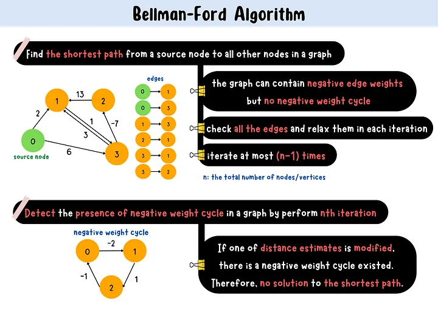

# Bellman-Ford Algorithm

Bellman-Ford Algorithm computes the single-source shortest path from a source node to all other nodes in a graph that 
can contain negative edge weights. However, if a graph contains a negative weight cycle, the solution to the shortest 
path will not be produced. This algorithm is also used to detect the presence of negative weight cycle in a graph.

   

## How Bellman-Ford Algorithm works?
This algorithm overestimates the distance from the source node to all other nodes in a graph initially. 
Then repeatedly visited all the edges and relax the estimate when a new shorter path is discovered in each iteration. 
If an iteration is not resulted in an update, we can stop the algorithm because the shortest path has been found. 
Otherwise, iterate all the edges at most n-1 times(n is the total number of nodes/vertices) since n-1 is the maximum 
length of the shortest path could take. If a graph has no negative cycle, we are guarantee to find the optimized result
after n-1 iterations.

## Why Iterate (n-1) times in Bellman-Ford Algorithm?
In Bellman-Ford Algorithm, we can iterate all the edges in any order and relax them. For the same graph, 
when we consider all the edges in different orders, we may get the optimized results after less than n-1 iterations 
or , in the worst case, need at most n-1 iterations to produces the shortest path .

## Complexity
* Time: O(v*e), Space: O(v)
    > v: the total number of vertices, e: the total number of edges
